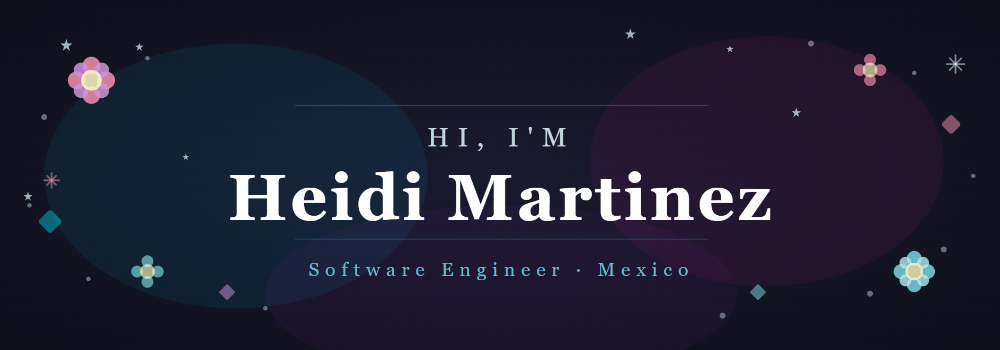

Hey there 👋

I'm Heidi, a Software Engineering student at UANL finishing my final year. I enjoy building things — from apps to interfaces — and I have a soft spot for design and making things look good. I've worked with languages like C/C++, JavaScript, Python, Swift and Kotlin, built mobile apps for Android and iOS, tinkered with hardware like Arduino and Raspberry Pi, and even dabbled in CAD and circuit simulation. I'm always excited to learn new tools and technologies along the way.

## 💻 Tech Stack

### Languages

### Mobile

### Design & Tools

### IDEs & Editors

### Hardware & Embedded

### CAD & Simulation

### Logic & Pseudocode

## 🚀 Projects

> 🚧 Coming soon...

## 🌱 Currently

In my final semester at UANL, learning something new every day.
